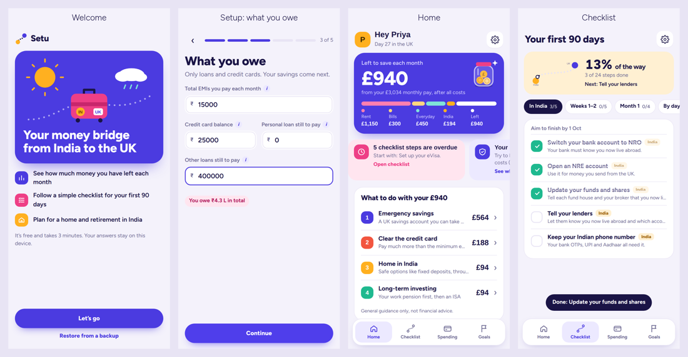

# Setu

**Your money bridge from India to the UK.** A free, private money planner for people moving from India to the UK.

## What it does
- Shows how much money you have left each month after UK costs and India payments
- Suggests a simple order for that money: emergency savings, expensive debt, a home in India, long-term investing
- A first-90-days checklist for both countries, with dates based on when you moved
- Tracks everyday spending against a monthly budget
- Plans for retirement and a home back in India

## Features
- **Monthly money:** take-home pay (England, Wales, NI or Scotland, 2026/27 rates), costs, India payments and what's left, in pounds and rupees
- **Spending:** quick logging, budgets by category, spending-pace warning, month-end forecast, repeating costs, search and filter, CSV export
- **Checklist:** first 90 days in the UK and India, with dates from your move
- **Goals:** retirement and a home in India, with fund types and their past performance
- **Live markets:** pound vs rupee, dollar and euro; Indian index moves; key UK and India rates
- **News:** headlines about your chosen investments, plus UK and India tax and policy changes (wide screens)
- **Transfer cost checker:** see the hidden exchange-rate cost of sending money home
- **Installable app (PWA):** add to home screen, works offline, and keeps data safer on iPhone
- **Backups:** download a backup file and restore it on another device

## Privacy
Everything runs in the browser. Data is saved only on the visitor's own device (browser local storage) and is never sent anywhere.

## Run it
It's a single static file. Open `index.html` in a browser, or host the folder on any static host.

### Deploy on Render
New > Blueprint (uses `render.yaml`), or New > Static Site with publish directory `.` and no build command.

## Disclaimer
General guidance only, not financial, tax or immigration advice.
